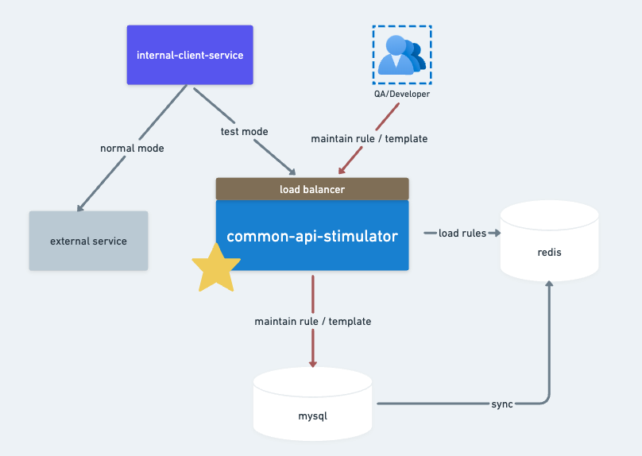
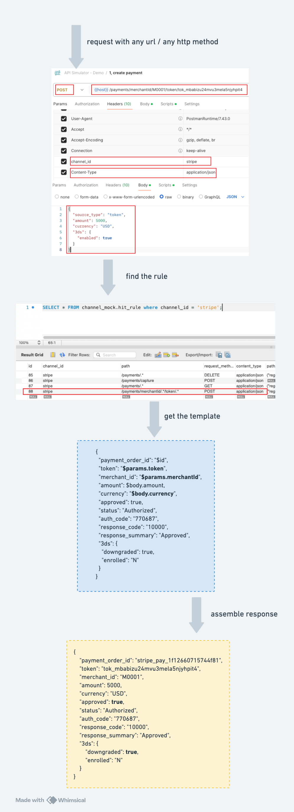

# Background

When developing a payment gateway system, we can leverage sandbox environments from external payment service providers (e.g., Checkout or Stripe) during the development phase. However, several limitations emerge when relying on these external sandbox payment environments:

- **Rate Limiting Constraints**: Sandbox environments enforce rate-limiting controls that cannot accommodate sudden traffic surges, such as load testing scenarios initiated from our services. This restriction prevents us from conducting effective load testing.
- **Limited Failure Simulation**: While sandbox environments can simulate specific business failures (e.g., authentication failures or 3D Secure verification failures through designated test card numbers), they lack the capability to replicate technical failures such as HTTP 500 errors or timeout exceptions. These technical failure scenarios are critical for chaos testing and validating payment retry mechanisms, which makes sandboxes unsuitable for such testing purposes.
- **Unreliable Availability**: Compared to production environments, sandbox payment systems exhibit lower stability. If our integration tests or automated test workflows depend on consistent responses from sandbox environments, intermittent failures may cause test case errors and disrupt CI/CD pipelines.
  To address these challenges, we propose this API simulator tool as a technical alternative to external payment service providers. It is specifically designed to resolve the aforementioned limitations while maintaining full compatibility with standard payment workflows.

# Functionalities

- **Seamless Integration**

  - Acts as a complete replacement for external payment service providers.
  - Ensures the response data structure precisely matches that of the actual payment APIs.
  - Guarantees end-to-end functionality of the entire payment workflow without requiring modifications to the existing integration logic.
- **Dynamic Response Generation**

  - Dynamically constructs responses based on specific conditions.
  - Example: Includes the `referenceId` from the request body in the response, which is validated in subsequent test cases.
  - Ensures data consistency and accuracy.
- **Stateful Behavior**

  - Maintains stateful interactions to replicate real-world payment workflows.
  - Examples:
    - A payment order created via a POST request can be queried using the ID returned in the initial response.
    - If the order is later canceled, subsequent queries reflect the updated status (e.g., "canceled").
  - Note: Not all test data is stateful; this behavior is configurable based on predefined rules.
- **Customizable Error Simulation**

  - Supports predefined rules to generate specific error responses for testing purposes.
  - Examples:
    - Introduces a 1-second delay when the order amount is `0.01`.
    - Returns an HTTP `505` status code when the amount is `5.05`.
  - Enables comprehensive testing of edge cases and error-handling mechanisms.
- **High Performance and Availability**

  - Designed to handle sudden traffic spikes and deliver 99.999% availability.
  - Architectural decisions:
    - **Redis Integration**:
      - Utilizes Redis to offload database operations.
      - Reduces latency and improves scalability.
    - **Containerized Deployment**:
      - Deployed as Docker images for consistent and portable environments.
    - **Load Balancing**:
      - Employs NGINX as a load balancer to distribute traffic efficiently and ensure high availability.

# Overall Design

# Usecase

# Sequence

# Databse

### 1. Simulate Rule Table: `simulate_rule`

| Column             | Type        | Description                                                                      | Example                                                        |
| ------------------ | ----------- | -------------------------------------------------------------------------------- | -------------------------------------------------------------- |
| `id`               | `int`       | Primary key                                                                      | `1`                                                            |
| `channel_id`       | `varchar`   | Channel identifier                                                               | `checkout`                                                     |
| `path`             | `varchar`   | Request path                                                                     | `/payments`                                                    |
| `content-type`     | `varchar`   | Request format (e.g., JSON, XML, form-data)                                 | `json`, `xml`, `form-data`                                     |
| `template_code`    | `varchar`   | Custom logic template code (each code represents a specific logic)          | `checkoutPayin`                                                |
| `req_reg_rule`     | `varchar`   | Regular expression for request parameters (applicable to non-JSON requests) |                                                                |
| `req_json_path`    | `varchar`   | JSON path for request parameters (applicable to JSON requests)              | ``[Amount.value, type]``                                       |
| `req_match_rule`   | `varchar`   | Rule to match request parameter values                                           | `end with .00 && type = Payout`                                |
| `status_code`      | `varchar`   | Response status code                                                             | `200`, `403`, `500`, `timeout.30`                              |
| `reponse_template` | `varchar`   | Response template (generates response based on the template)                | ``{"status":"success","value":"${requestBody.Amount.value}"}`` |
| `createAt`         | `timestamp` |                                                                                  |                                                                |
| `updatedAt`        | `timestamp` |                                                                                  |                                                                |
| `createBy`         | `varchar`   |                                                                                  |                                                                |
| `updatedBy`        | `varchar`   |                                                                                  |                                                                |

---

### 2. Cache Rule Table: `cache_rule`

(Applies to stateful interfaces; stateless interfaces may not require configuration.)

| Column                       | Type        | Description                                                                                                                        | Example                                                                                      |
| ---------------------------- | ----------- | ---------------------------------------------------------------------------------------------------------------------------------- | -------------------------------------------------------------------------------------------- |
| id                           | int         | Primary key                                                                                                                        | 1                                                                                            |
| mock_rule_id                 | int         | ID from the mock_rule table for association                                                                                        | 1                                                                                            |
| cache_option                 | varchar     | Cache operation (e.g.,get, put)                                                                                               | get, put                                                                                     |
| req_cache_rule               | varchar     | Rule to extract keys from request parameters                                                                                       | [id, type]                                                                                   |
| cache_body                   | varchar     | Cached data                                                                                                                        | {"currency":"$`{requestBody.currency}","amount":"`${requestBody.amount}","status":"created"} |
| cache_body_match_rule        | varchar     | Rule to match cached data                                                                                                          | status = created AND currency=USD                                                            |
| match_error_reponse_template | varchar     | Response template when cache_body_match_rule fails to match                                                                        |                                                                                              |
| cache_time                   | long        | Cache duration in seconds                                                                                                          | 100                                                                                          |
| null_reponse_template        | varchar     | Response template when cache expires                                                                                               |                                                                                              |
| reponse_template             | text        | Response template ( returns cached value if available; otherwise,  returns the value from the mock_rule table) |                                                                                              |
| match_status_code            | varchar     | Response status code for successful matches                                                                                        | 200, 403, 500, timeout.30                                                                    |
| match_error_status_code      | varchar     | Response status code when cache_body_match_rule fails to match                                                                     | 200, 403, 500, timeout.30                                                                    |
| null_match_status_code       | varchar     | Response status code when cache expires                                                                                            | 200, 403, 500, timeout.30                                                                    |
| createAt                     | `timestamp` |                                                                                                                                    |                                                                                              |
| updatedAt                    | `timestamp` |                                                                                                                                    |                                                                                              |
| createBy                     | `varchar`   |                                                                                                                                    |                                                                                              |
| updatedBy                    | `varchar`   |                                                                                                                                    |                                                                                              |

---

# API

- TODO

# Testcase

- TODO

# How to run

- TODO
